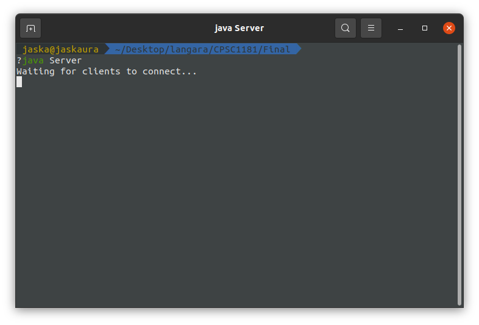
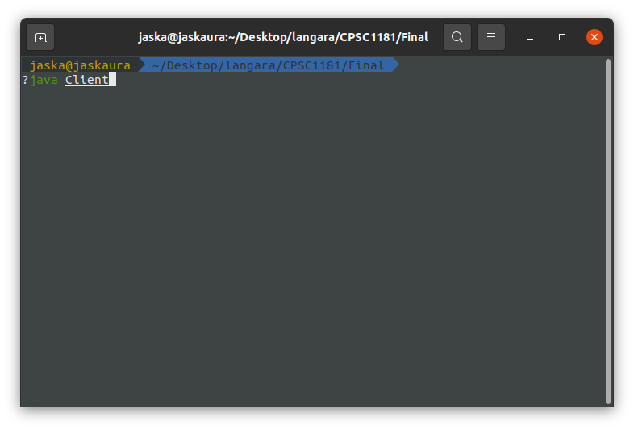
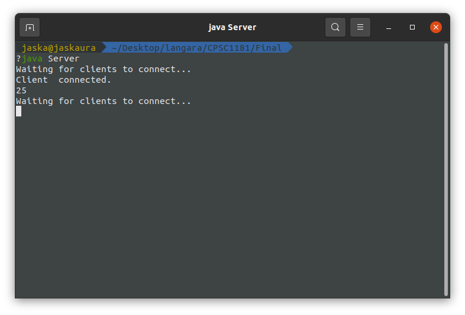
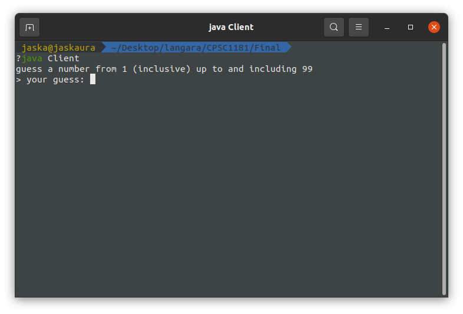
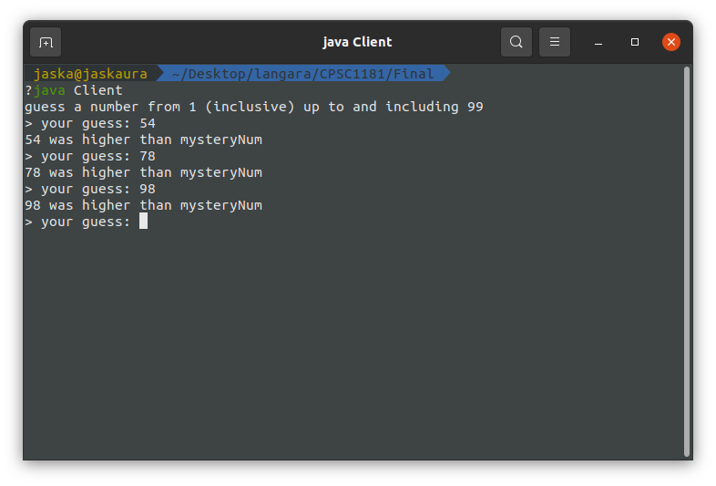
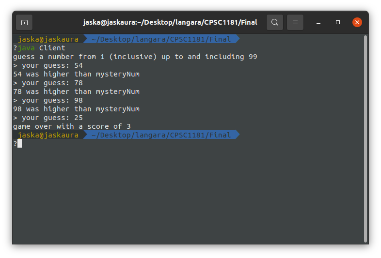

# Client-Server-Number-Guess

> Client-Server number guessing game.
> Server generates a number between 0 and 99. The client has to guess the number. For every wrong guess it costs 3 score. The lower the score the better.

## Running Program

OS X, Linux terminal, Windows:

```sh
javac *.java
```

* Step 1: Open terminal/cmd and excute following command
```sh
java Server
```


* Step 2: Open a new terminal/cmd and excecute the following command
```sh
java Client
```




* Step 3: Guess the number until you guesses the correct number


